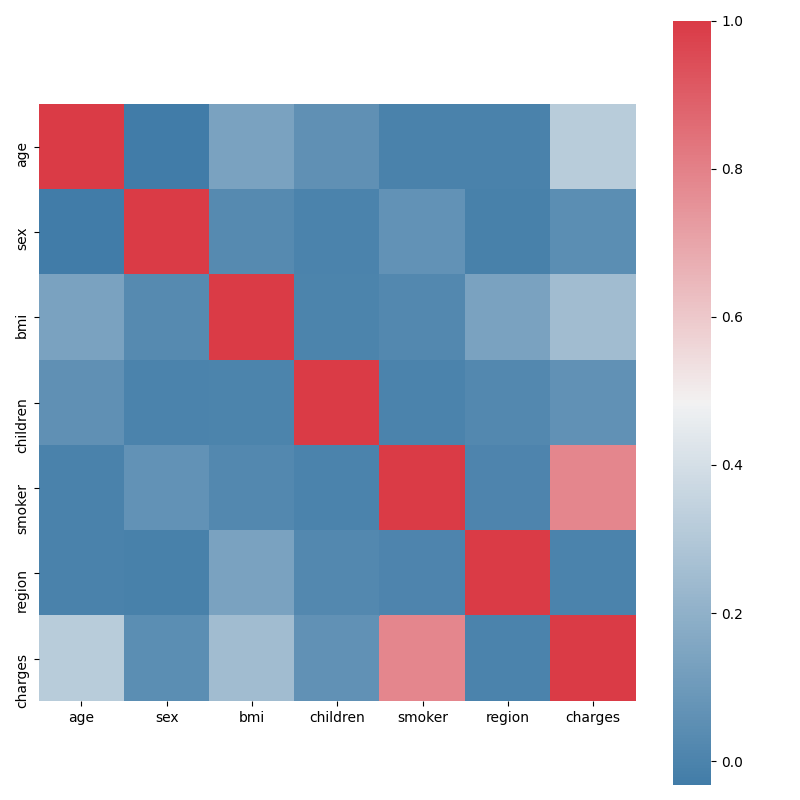
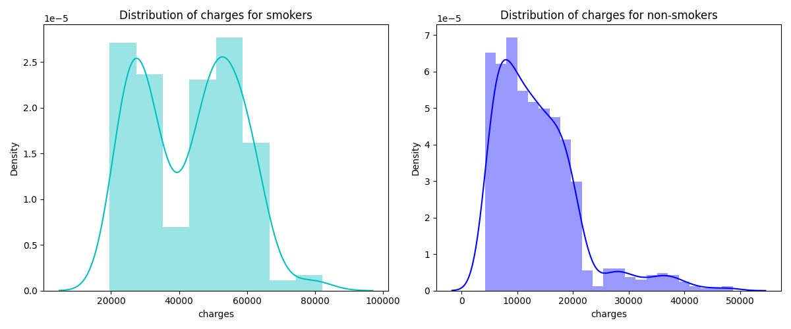
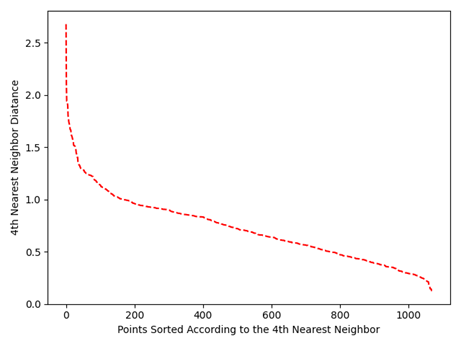
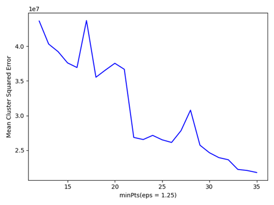
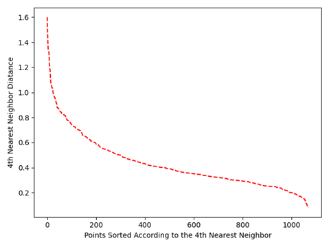
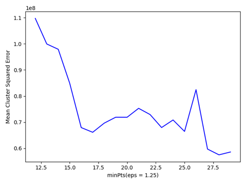
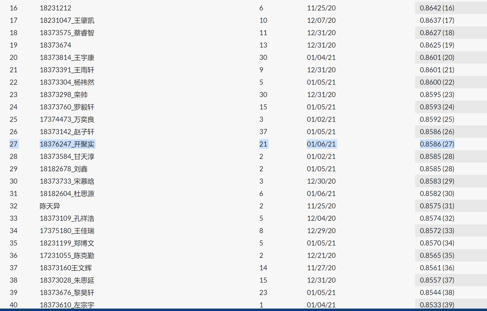

## 医疗费用预测

### 一、项目概述

**简介**：根据年龄，性别，bmi，孩子个数，吸烟，生活地区来预测个人医疗花费。
**任务目标**：预测医疗花费数据。
**数据集**：训练集1071，测试集268。
**评价指标**：R-square进行评价，相对MSE更好地衡量模型性能。

**项目链接**：https://github.com/0-KaiKai-0/BUAA_ML_Medical-Charges

本任务是一个回归问题，直接由样本属性来对目标（医疗费用）进行预测。

### 二、数据分析

本任务的样本中直接给出了属性数据，因此对数据分布和关联关系的分析在本任务中十分重要。

#### 2.1 数据预处理

原始数据中"sex", "smoker", "region"这些属性都是非数值型数据，需要将其转换为自然数（如"sex"属性中的"male", "female"两种类别分别转化为1和0两种数值）。

#### 2.2 数据初步分析

计算各属性（包括"charges"）之间的关联度，绘制热力图，并将各属性和"charges"之间的关联度从小到大排序，如下所示。

|  属性  |  region   |   sex    | children |   bmi    |   age    |  smoker  | charges  |
| :----: | :-------: | :------: | :------: | :------: | :------: | :------: | :------: |
| 关联度 | -0.003634 | 0.047719 | 0.063667 | 0.246438 | 0.315081 | 0.783475 | 1.000000 |

针对其他属性中与"charges"关联度最大的属性"smoker"，绘制smokers与non-smokers的"charges"分布图像，如下图所示。

可以很明显地观察到smokers的医疗花费普遍高于non-smokers。

### 三、聚类分析：DBSCAN

DBSCAN算法是一种基于密度的聚类算法。我在本任务中自行实现了这一算法，并封装了DBSCAN类。

#### 3.1 名词定义

- **Core point**：在半径为eps的邻域内至少存在minPts个点的节点。

- **Border point**：Core point的邻域内的非Core point节点。

- **Noise point**：非Core point，非Border point节点。

#### 3.2 算法流程

（1）将所有节点加入未访问集合（unvisited）。

（2）从集合中选出一个节点i，记录节点i的eps邻域内的所有节点。若其邻域内的节点数≥minPts，则说明节点i为Core point，将节点i的eps邻域内所有节点标记为一个簇；将节点i的eps邻域内所有Core point的eps邻域内的所有节点也标记为同一个簇。

（3）重复执行步骤（2），直到所有节点都已被访问，未标记簇号的节点即为Noise point。

#### 3.3 节点距离

节点间的距离有多种衡量方式——欧氏距离、余弦距离、闵可夫斯基距离（欧氏距离、曼哈顿距离均可视为闵可夫斯基距离的特殊情形）。

 这些距离在DBSCAN类中都已实现，以下实验结果均使用欧氏距离。

#### 3.4 参数设置

（1）**eps**的值可以使用绘制k-距离曲线(k-distance graph)方法得到，在k-距离曲线图明显拐点位置为对应较好的参数。若参数设置过小，大部分数据不能聚类；若参数设置过大，多个簇和大部分对象会归并到同一个簇中。

K-距离：给定K邻域参数k,对于数据中的每个点，计算对应的第k个最近邻域距离，并将数据集所有点对应的最近邻域距离按照降序方式排序，称这幅图为排序的k距离图，选择该图中第一个谷值点位置对应的k距离值设定为eps。一般将k值设为4。

（2）**minPts**的值通过计算所有聚类中的样本关于各自Core Point的charges的平均方差（CSE），选取图像中合适的拐点得到。一般认为$minPts\ge dim+1$，其中dim表示待聚类数据的维度。

### 四、数据降维：PCA

本任务中除"charges"这一属性之外还有6个属性，其中可能存在冗余信息和噪声信息，会在实际应用中引入误差，影响准确率；而降维可以提取数据内部的本质结构，减少冗余信息和噪声信息造成的误差，提高应用中的精度。

主成分分析(PrincipalComponentAnalysis, PCA)，将原有众多具有一定相关性的指标重新组合成一组少量互相无关的综合指标。

我采用**最大方差思想**，自行实现了PCA算法，并进行了封装。因为课堂上有具体介绍，所以这里不再过多展开了。

经过实验，我最终选择将数据降到4维：age, bmi, children, smoker。这与2.3中分析的与charges关联度最大的四个属性一致。降至4维后，进行DBSCAN参数选择的图像如下所示。

### 五、模型与调参

#### 5.1 模型选择

- 多项式回归模型（PolynomialFeatures）：考虑到不同属性之间可能存在非线性的组合关系对"charges"产生影响，因此选择二次多项式回归模型来进行预测。
- 随机森林回归模型（RandomForestRegressor）：因为样本数量小且属性特征也较少，所以使用集成学习的方法是模型有更强的泛化性和鲁棒性。

#### 5.2 实验与调参

##### 5.2.1 模型加权

通过尝试线性模型、多项式模型和随机森林模型及其组合，最终确定测试集的预测值为
$$
test\_pred = weight\cdot test\_pred_1 + (1-weight)\cdot (test\_pred_2-bias)
$$
其中$test\_pred_1$为多项式回归模型的预测结果，$test\_pred_2$为随机森林回归模型的预测结果。$weight$和$bias$为超参数，经过实验分别确定为0.4和300。随机森林回归模型中的子模型数n_estimators设定为500。

##### 5.2.2 数据降维

之前已经通过PCA分析出可以将数据降至4维。经过实验，选择在多项式回归模型中使用降维的数据，而随机森林回归模型中还是使用原始数据。（这是因为我们的数据量较小，模型复杂度较小，所以当使用集成的方法时，保留更多的原始信息更能提升模型的表现）

##### 5.2.3 其他实验

我还尝试了用聚类分析的结果来预测医疗费用——使用每个聚类的Core Point来代表这个聚类，计算测试集中每个样本的医疗费用预测值表示为所有Core Point费用的加权平均，其中权重由样本与Core Point的距离（余弦距离、曼哈顿距离、欧氏距离）计算得到。但效果不好，故没有采用。

### 六、结果[^2]

**排名**：27

**R-square**：0.8586

[^1]: https://pytorch.org/docs/stable/_modules/torchvision/models/resnet.html#resnet34
[^2]: 截止于2021年1月6日20:44，两个任务的排名如报告中所述

